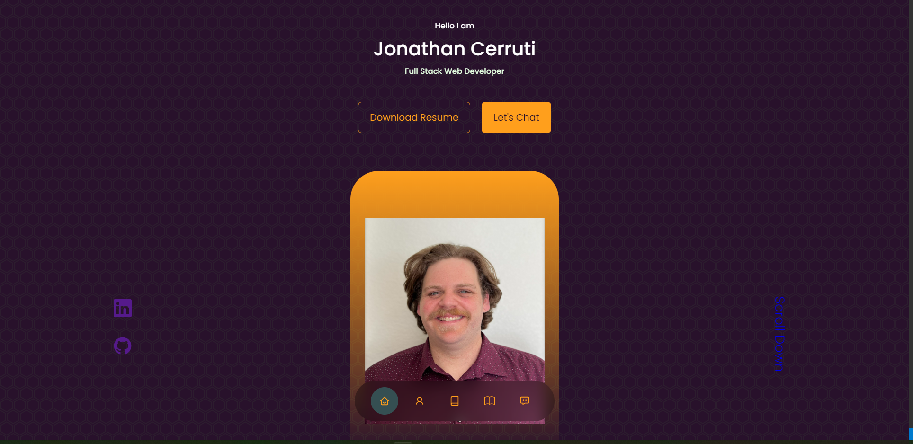
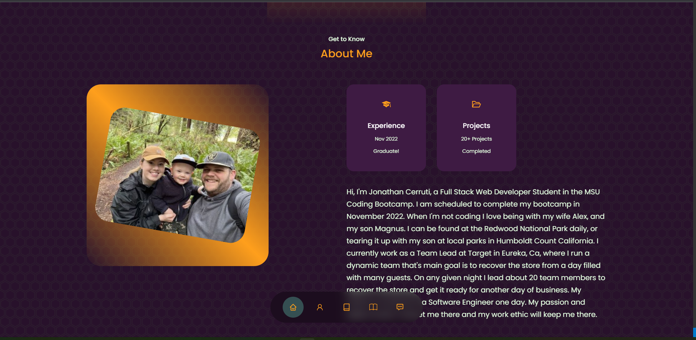
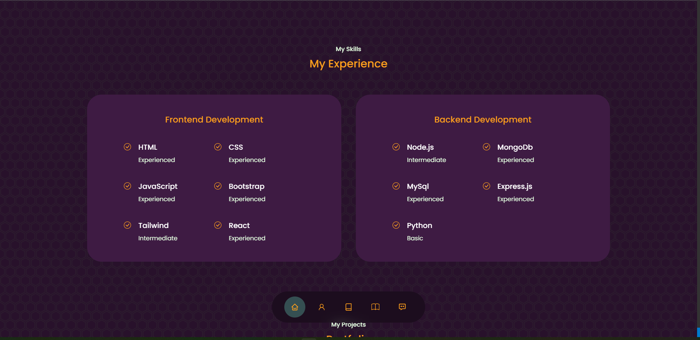
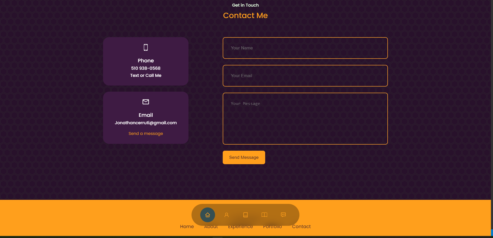

# REACT Super Awesome Portfolio
## Badges 

---

## Table of Contents
- [License](#license)
- [Description](#description)
- [Usage](#usage)
- [Installation](#installation)
- [Application](#application)
- [Questions?](#questions)
- [Contact Me](#contact-me)

---

## License
[MIT](https://opensource.org/licenses/MIT)
Read more about MIT

---

## Description
This is a single-page application portfolio that is used to showcase my previous projects to help potential employers determine if I am a good candidate for a potential position. This application was built and deployed using REACT.

---

## Installation
npm run start
Run <code> npm install </code>

---

## Usage

Run <code> npm start </code>

---

## Application

[Portoflio](https://joncerruti.github.io/Super_Awesome_Portfolio/)

Header           |  About Me
:-------------------------:|:-------------------------:
  |  

Experience      |  Portfolio
:-------------------------:|:-------------------------:
  |  

Contact Form      |  Footer
:-------------------------:|:-------------------------:
  |  

---

---

## Questions?
##### Contact Me
- [GitHub](https://github.com/Joncerruti)
- [Email](jonathancerruti@gmail.com)
